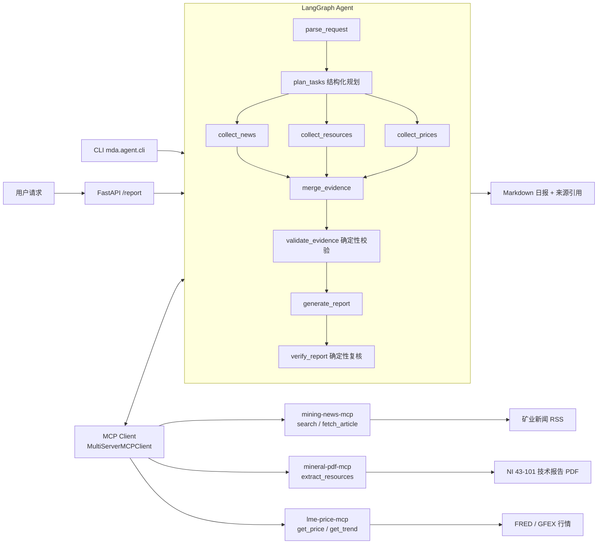
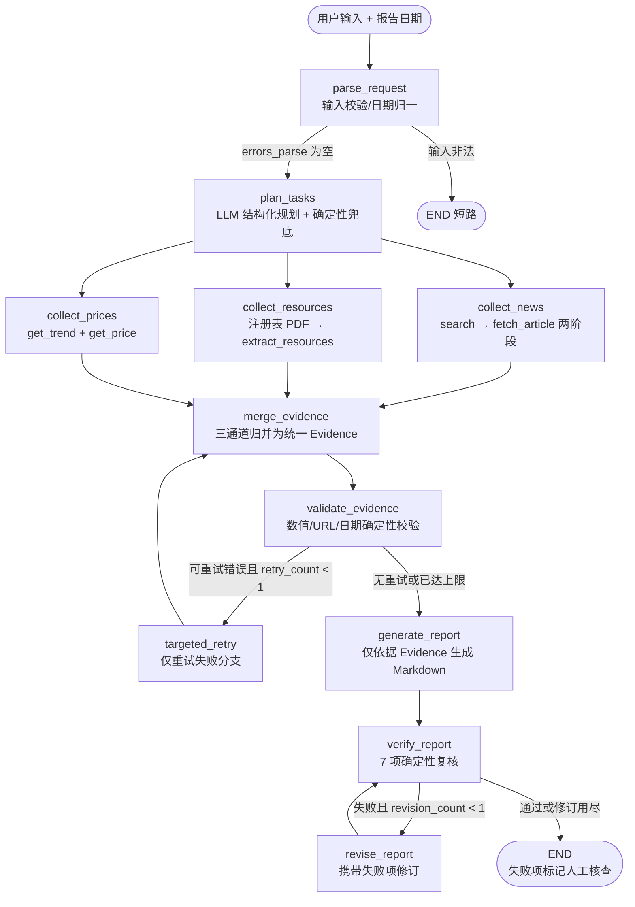

# Mining Daily Agent

中文名称：**矿权日报 Agent** — Mining intelligence agent powered by LangGraph, MCP, Python and FastAPI.

## 项目介绍

矿业新闻、技术报告（NI 43-101 / JORC）与商品价格数据分散在不同站点，人工查询和交叉核验成本高，且 LLM 直接回答容易产生幻觉。

本项目基于 **Python + LangGraph + MCP**，将不同来源的信息封装为**三个独立 MCP Server**（新闻检索、PDF 资源量抽取、价格查询），由 LangGraph Agent 通过**真实 MCP 协议**自动编排工具调用、结构化抽取与**确定性证据校验**，生成带来源引用、页码证据与缺失披露的 Markdown 矿业日报。

> 核心设计原则：**报告中的每一条事实都必须来自工具返回的 Evidence**；校验不依赖 LLM 自评，而是确定性代码检查（数值/URL/日期/缺失披露），失败项显式标记人工核查，绝不编造。

## 核心能力

1. **MCP 多服务工具集成**：3 个独立 MCP Server（stdio + Streamable HTTP 双传输），Agent 经官方 SDK 客户端真实协议调用
2. **LangGraph 工作流编排**：11 节点状态图，三路并行收集、条件路由、有界重试（补检索 ≤1 次、报告修订 ≤1 次）
3. **新闻搜索与正文抓取**：真实矿业 RSS（mining.com 等）+ trafilatura 正文提取，SSRF 防护、去重、日期过滤
4. **NI 43-101 资源量抽取**：PyMuPDF + pdfplumber 表格解析（列错位/多级表头容错）、VLM 兜底、Li₂O→LCE / 黄金换算量级校验、合计行防重复计算、跨页去重
5. **商品价格查询与趋势分析**：FRED 基本金属月度均价 + GFEX 碳酸锂期货日线；非交易日显式标记，绝不静默冒充
6. **Evidence 证据校验**：统一证据模型（来源/URL/页码/原文/单位），数值、单位、日期一致性检查
7. **Markdown 日报生成**：执行摘要/新闻/资源量/价格/风险/缺失披露/参考来源七章节，全部带证据引用
8. **异常重试与失败降级**：16 个机器可识别错误码；网络重试（指数退避 ×2）、Agent 补检索（×1）、报告修订（×1）；数据缺失显式披露
9. **Docker Compose 部署**：4 容器（3 MCP Server + API），健康检查、卷挂载、一键冒烟测试
10. **自动化测试**：单元 122 + MCP 协议合同 22 + e2e/故障注入 14 + 真实数据集成 6 + 真实 LLM 3（详见 [TEST_REPORT.md](TEST_REPORT.md)）

## 技术栈

| 层 | 技术 |
|---|---|
| Agent 编排 | LangGraph 1.x（StateGraph + 条件边 + 并行 fan-out） |
| MCP | MCP Python SDK（FastMCP 服务端 / stdio / streamable-http），langchain-mcp-adapters |
| LLM | 可配置 OpenAI 兼容端点（默认 DashScope qwen-plus；VLM 兜底 qwen-vl-plus） |
| API | FastAPI + Pydantic v2 |
| 数据 | httpx / feedparser / trafilatura / PyMuPDF / pdfplumber |
| 可靠性 | structlog 结构化日志 / tenacity / 文件缓存（retrieved_at 标注） |
| 测试 | pytest / pytest-asyncio / respx / ruff / mypy |
| 部署 | Docker Compose（python:3.11-slim） |

## 系统架构



## LangGraph 执行链路（与 `mda/agent/graph.py` 实际一致）



- 三个 `collect_*` 节点**并行执行**，各自独占 State 通道（`news/errors_news/missing_news` 等），无写入冲突
- 全部外部调用经 MCP 协议（`MultiServerMCPClient` → JSON-RPC），Agent 层不直接 import 任何业务函数

## MCP 工具清单

| MCP Server | Tool | 功能 | 关键输出 |
|---|---|---|---|
| mining-news-mcp | `search(query, days)` | 矿业新闻检索（多源并发、去重、相关性排序） | 文章列表（真实 URL/来源/发布时间） |
| mining-news-mcp | `fetch_article(url)` | 新闻正文抓取（SSRF 防护、正文清洗） | 清洗后正文 + 元数据 |
| mineral-pdf-mcp | `extract_resources(pdf_url)` | NI 43-101 资源量表抽取（文本解析+VLM 兜底+量级校验） | 资源量记录（吨位/品位/金属量/页码/表格原文） |
| lme-price-mcp | `get_price(commodity, date)` | 指定日期报价（非交易日显式标记） | 实际报价日期/币种/单位/是否估算 |
| lme-price-mcp | `get_trend(commodity, days)` | 历史价格走势（同口径涨跌幅） | 起止价/涨跌幅/完整数据点/来源 URL |

所有工具返回统一契约 `{status, data, error, metadata}`，错误携带机器可识别错误码（16 种，如 `DATA_UNAVAILABLE` / `RESOURCE_TABLE_NOT_FOUND` / `MCP_CONNECTION_FAILED`）。

## 快速部署

与 [RUN.md](RUN.md) 一致：

```bash
# 1. 配置环境（密钥只走环境变量，.env 不入库）
cp .env.example .env        # 填入 LLM_API_KEY（OpenAI 兼容端点均可）

# 2. 一键启动（4 容器：3 MCP Server + API）
docker compose up -d --build

# 3. 等待 healthy
docker compose ps
```

```bash
# 健康与依赖检查（三个 MCP Server 连接性 + 工具清单 + LLM 配置）
docker compose exec agent-api python scripts/smoke_test.py --base http://agent-api:8000

# 生成日报（真实 LLM + 真实数据，约 2-8 分钟）
curl -X POST http://localhost:8000/report -H "Content-Type: application/json" \
  -d '{"query":"给我生成一份关于 Pilbara 锂矿的今日简报","report_date":"2026-10-08"}'

# 停止
docker compose down
```

本地 CLI（无需 Docker，stdio MCP）：

```bash
pip install -e .[dev]
python -m mda.agent.cli "给我生成一份关于 Pilbara 锂矿的今日简报" --date 2026-10-08 --out reports/demo.md
```

## 项目运行示例

一份**真实生成的日报**见 [examples/sample-report.md](examples/sample-report.md)：

- 数据截至 2026-10-08（生成于 2026-10-09，一次真实运行存档）
- 新闻：mining.com / australianmining.com.au 真实文章（报告内附原文 URL）
- 资源量：Sigma Lithium Grota do Cirilo NI 43-101 报告（19 条记录，含页码与表格原文；**非 Pilbara 目标矿区**，已在报告中显式标注）
- 行情：GFEX 碳酸锂期货（CNY/tonne），并标注「非锂精矿价格」口径差异
- 状态说明：`success`（确定性校验零失败）；当数据源缺失或记录需人工复核时返回 `partial`，并如实写入「数据缺失与限制」章节

## 测试与验证

```bash
pytest -q                                    # 单元 122 + 协议合同 22 + e2e 14（Mock 隔离，约 2 分钟）
RUN_LIVE_TESTS=1 pytest tests/integration    # 真实数据源集成 6 项（需网络）
RUN_LLM_TESTS=1  pytest tests/e2e/test_real_llm.py  # 真实 LLM 3 项（需密钥）
ruff check . && ruff format --check . && mypy mda   # 质量门禁
```

| 测试类别 | 数量 | 说明 |
|---|---|---|
| 单元测试 | 122 | 安全/新闻/PDF 解析与校验/价格/契约/校验器 |
| MCP 协议合同测试 | 22 | **真实 stdio + streamable-http 会话**（SDK 客户端↔服务端），9 类故障注入 |
| Agent e2e | 14（默认）+3（门控） | 完整图执行、空输入短路、提示注入隔离（真实 LLM） |
| 真实数据集成 | 6（门控） | 真实新闻/正文/NI 43-101 逐值核对/锂价/FRED/三 Server 联合 |
| 质量门禁 | — | ruff check / format / mypy 全绿 |

> 跳过项均为需要外部密钥或网络的门控测试（如实标注，不冒充通过）。完整记录见 [TEST_REPORT.md](TEST_REPORT.md)。

## 已知限制（如实披露）

- **Pilbara 目标矿区无 NI 43-101 报告**：Pilbara Minerals 等 ASX 上市矿企采用 JORC 标准；日报显式披露该缺失，以真实 Sigma Lithium 报告完成工具能力验收（标注非目标矿区），绝不将 JORC 数据伪装为 NI 43-101
- **锂精矿（spodumene）/ 氢氧化锂无免费报价源**（Fastmarkets 等为商业订阅）：使用 GFEX 碳酸锂期货作为最接近的公开锂产品口径，并显式标注差异；黄金/白银无免费源（FRED 序列 2022 年下架）
- **外部数据源访问限制**：LME 官网对本环境 Cloudflare 阻断；Google News/百度 RSS 在本网络不可达（Provider 已实现，默认关闭）；FRED 月度数据滞后约 3 个月（窗口显式扩展并警告）；新浪接口无 SLA（降级 `DATA_UNAVAILABLE`）。详见 [DATA_SOURCES.md](DATA_SOURCES.md)
- **PDF 表格解析局限**：复杂金矿报告表头（如 Novador PEA）的品位单位识别覆盖不全时，记录降级为 `needs_review` 并如实披露，不当事实输出
- **真实 LLM 输出波动**：约 1/5 次运行存在断言级差异；系统通过「修订一次 + ⚠️人工核查标记」兜底

## 项目文档

- [RUN.md](RUN.md) — 一键启动、验收步骤、MCP Inspector 等效验证
- [DATA_SOURCES.md](DATA_SOURCES.md) — 数据源可行性实测表与许可说明
- [TEST_REPORT.md](TEST_REPORT.md) — 测试总数、故障注入覆盖、缺陷修复记录
- [examples/sample-report.md](examples/sample-report.md) — 真实生成的日报示例

## 目录结构

```
mining-daily-agent/
├── mda/
│   ├── agent/          # LangGraph Agent（graph/state/planner/mcp_client/nodes/verify）
│   ├── servers/        # 三个独立 MCP Server（mining_news / mineral_pdf / lme_price）
│   ├── api/            # FastAPI（/health /health/dependencies /report）
│   └── common/         # 统一契约/错误码/SSRF 防护/安全 HTTP/日志/缓存
├── tests/              # unit / contract / integration / e2e / fixtures
├── scripts/            # verify_mcp.py / smoke_test.py / generate_mcp_config.py
├── examples/           # 真实生成的示例日报
├── data/known_pdfs.json  # 已验证的 NI 43-101 PDF 证据注册表
├── Dockerfile / docker-compose.yml / mcp-config.json
└── pyproject.toml / uv.lock
```

## License

本项目为求职展示用途的工程实践项目；外部数据（新闻、技术报告、行情）版权归原来源所有，仅用于研究验证，见 [DATA_SOURCES.md](DATA_SOURCES.md)。
